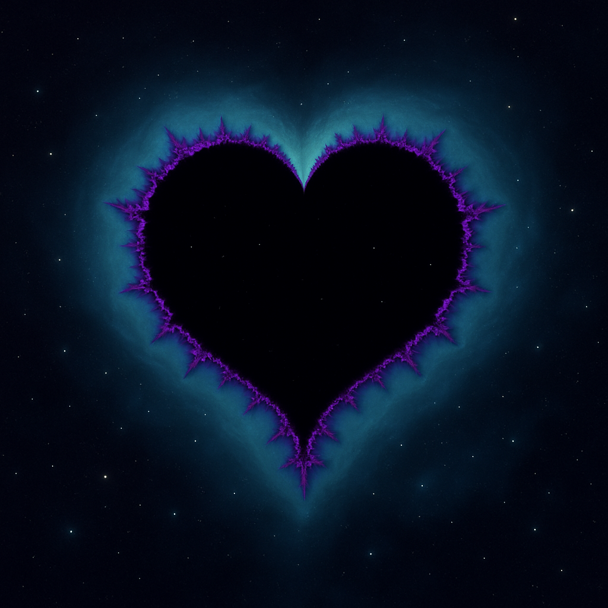

# TYPEWRITER OF SECRETS — STAR VAULT



welcome to **typewriter of secrets**, a calm, retro-inspired web app where you can write, scramble, and safely store your anonymous secrets.  
every secret can be protected with a **4-digit pin**, keeping your private thoughts tucked away locally.  

> coming soon: login/backup feature to make sure your secrets never vanish even if your browser cache is cleared.  

---

## 🔹 PREVIEW

### 1. MAIN SITE
type your secrets, scramble them, and watch them float into the archive.  


### 2. VIDEO BACKGROUND MODE
enjoy a **starry, calm, nostalgic space vibe** while writing your secrets.  


### 3. PIN SECURITY
lock each secret with a **4-digit code**, making it visible only to you.  


---

## ⚡ QUICKSTART (LOCAL)

clone the repo and run it locally:

```bash
git clone https://github.com/yourusername/typewriter-of-secrets.git
cd typewriter-of-secrets

# serve locally
python -m http.server 8080
# open in browser
http://localhost:8080
````

---

## 🛡 SECURITY NOTES

* **local encryption only** — the 4-digit pins have \~10,000 combinations; pbkdf2 slows brute-force attempts
* for highly sensitive secrets, consider **longer passphrases**
* secrets are stored in **localStorage** by default

> remember: this is meant for **fun and nostalgic experience**, not top-tier security for ultra-sensitive data.

---

## 💾 FEATURES

* retro 80s/90s aesthetic with **Press Start 2P font**
* **smooth typing animation** with ambient keyboard sound
* secrets **scrambled** visually and stored locally
* **pin-protected secrets** to decode only with correct code
* archive display with floating orbs and subtle glow
* optional **video background** for calm, nostalgic vibes
* fully **responsive** for smartphones and tablets

---

## 🌌 AESTHETIC VIBES

the app draws inspiration from:

* calm Japanese web aesthetics
* retro typewriters and CRT glow
* starry space backgrounds and gentle motion
* ghibli-style nostalgic, dreamy vibes

every interaction is designed to feel **soothing, minimal, and immersive**.

---

made with ❤️ by haku ✨
```
