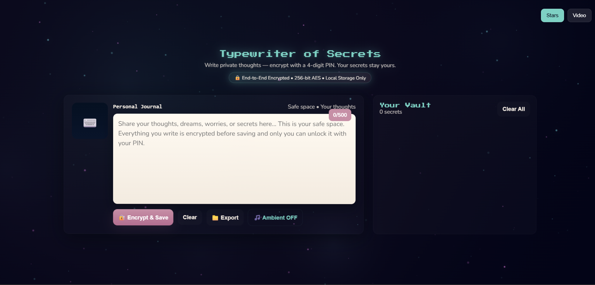
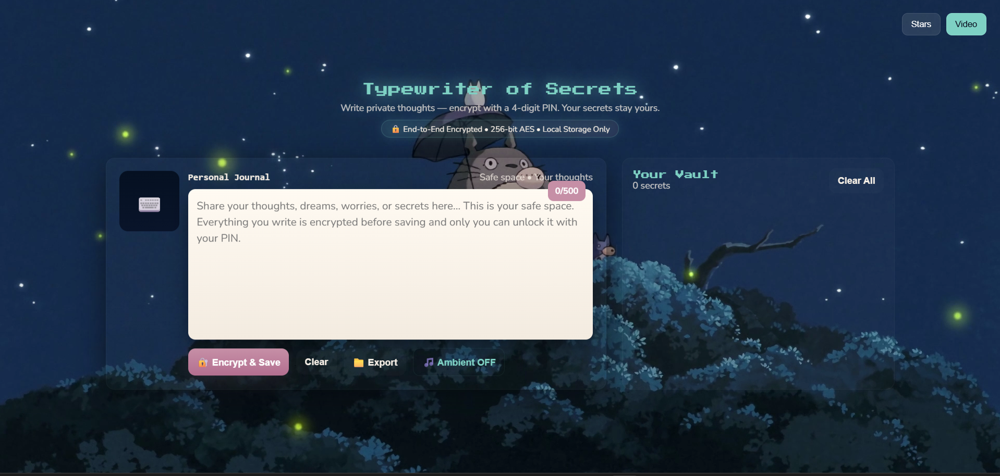

# typewriter of secrets — star vault

hey! welcome to my calm, ghibli-inspired retro typewriter web app.  
write short secrets, lock them with a 4-digit pin, and store them locally.  

**coming soon:** an optional login / backup feature so your secrets won't disappear if your browser cache or localstorage gets cleared.

---

## previews

three prepared images:

- `preview-normal.png` — default ui (typing area + archive)  
- `preview-video.png` — same ui with background video  
- `preview-pin.png` — pin keypad / unlock modal





---

## features

- ✍️ type short secrets (~280 chars)  
- 🔐 per-secret 4-digit pin encryption (pbkdf2 → aes-gcm)  
- ✨ scrambled glyph preview in archive (mysterious orbs)  
- 🔓 unlock via keypad modal, burn to delete permanently  
- 🎵 ambient typing + chime sounds (toggleable)  
- 🌌 starfield canvas or optional background video (`video.mp4` in root)  
- 📦 export/import encrypted archive (json)  
- 📱 responsive, mobile-first layout

---

## quickstart (local)

```bash
git clone https://github.com/yourusername/typewriter-of-secrets.git
cd typewriter-of-secrets

# serve locally
python -m http.server 8080
# open http://localhost:8080
````

---

## generate previews (puppeteer)

```bash
npm init -y
npm i puppeteer
node thumbs.js http://localhost:8080
```

produces `preview-normal.png`, `preview-video.png`, `preview-pin.png`.

---

## security notes

* encryption is local only; 4-digit pins have \~10k combos, pbkdf2 slows brute-force
* highly sensitive secrets should use longer passphrases
* secrets are stored in localstorage by default

---

## credits & fonts

* headings: press start 2p
* body: nunito

```html
<link href="https://fonts.googleapis.com/css2?family=Press+Start+2P&family=Nunito:wght@300;400;700&display=swap" rel="stylesheet">
```

made with calm vibes by haku ✨

do you want me to do that?
```
