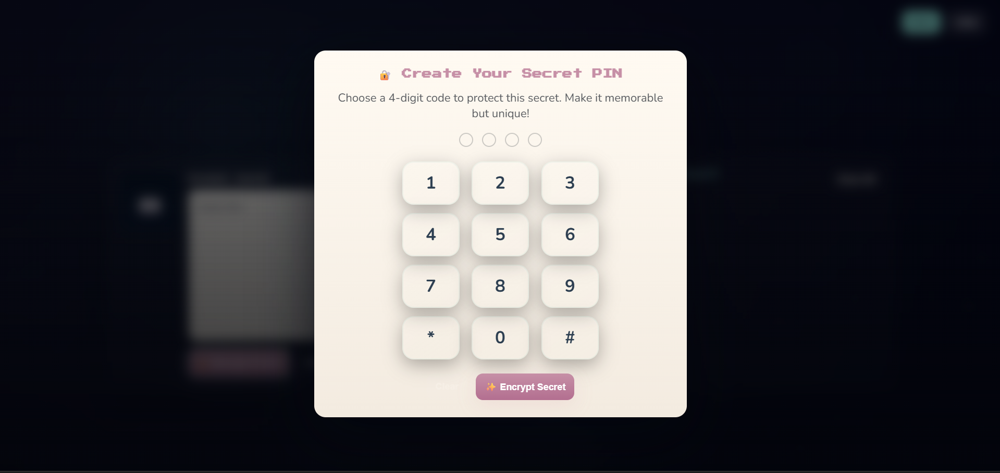

# typewriter of secrets — star vault


hey! welcome to my calm, retro typewriter web app.  
you can write short secrets, lock each one with a 4-digit pin, and keep them safe locally.  

**coming soon:** login/backup feature so your secrets won't disappear if your browser cache or localstorage gets cleared.

---

---

## previews

to get the retro vibes, check these previews (recommended video bg mode):

- **default ui** (typing area + archive)  
  
- **background video aesthetic**  
  
- **pin security modal**  
  
---

## features

- ✍️ type short secrets (~500 chars)  
- 🔐 lock each secret with a 4-digit pin  
- ✨ scrambled glyph preview in archive (mysterious orbs)  
- 🔓 unlock via keypad modal, burn to delete permanently  
- 🎵 ambient typing + chime sounds (toggleable)  
- 🌌 starfield background simulated in previews (video or gif)  
- 📦 export/import encrypted archive (json)  
- 📱 mobile-first, responsive layout

---

## quickstart (local)

```bash
git clone https://github.com/yourusername/typewriter-of-secrets.git
cd typewriter-of-secrets

# serve locally
python -m http.server 8080
# open http://localhost:8080
security notes
encryption is local only; 4-digit pins have ~10k combos, pbkdf2 slows brute-force

for highly sensitive secrets, consider longer passphrases

secrets are stored in localstorage by default


made with calm vibes  by haku
